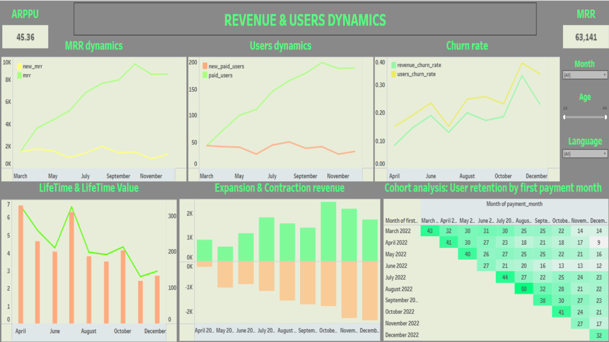

# Revenue & Users Dynamics

## 📊 Опис проєкту  
Проєкт аналітики підпискового бізнесу, спрямований на відстеження динаміки грошових надходжень та поведінки користувачів у заданому періоді.

## 🎯 Мета  
Проаналізувати ключові бізнес-показники, що відображають доходи, утримання та активність користувачів, а також виявити загальні тренди розвитку продукту.

## ⚙️ Функціонал  
- Інтерактивні графіки в Tableau  
- Фільтри за датою, віком та мовою користувача  
- Аналіз фінансових та користувацьких метрик у динаміці  

## 🛠 Використані технології  
- SQL (робота з навчальною базою даних)  
- Tableau (візуалізація та побудова дашборду)  

## 📈 Основні метрики  
- MRR  
- New MRR  
- ARPPU  
- LTV  
- LT  
- Churned Revenue  
- Expansion Revenue
- Contraction Revenue
- Revenue Churn Rate  
- Users Churn Rate  
- Paid Users  
- New Paid Users  
- Churned Users

## 📊 Dashboard Preview

## 📌 Дані  
Використано навчальну базу даних. Відтворення сирих даних не передбачено.

## 💡 Висновки

- Динаміка MRR корелює зі зростанням кількості платних користувачів, що свідчить про стабільне збільшення повторюваного доходу протягом досліджуваного періоду.
- Незважаючи на зростання доходу, показники users churn rate та revenue churn rate також мають тенденцію до збільшення, що може свідчити про скорочення життєвого циклу частини користувачів.
- Графік expansion revenue демонструє стабільне зростання доходу від існуючих користувачів, тоді як contraction revenue також залишається суттєвим, що вказує на часткову втрату доходу в окремих сегментах користувачів.
- Cohort analysis показує поступове зниження утримання користувачів у наступних періодах після першої оплати.
- Отримані результати можуть свідчити про фокус компанії на збільшенні короткострокового доходу та монетизації активних користувачів при недостатній увазі до довгострокового утримання аудиторії.

### Можливі напрями покращення утримання користувачів

- персоналізовані пропозиції та рекомендації;
- програми лояльності для постійних користувачів;
- бонуси за тривале користування сервісом;
- покращення onboarding-процесу;
- сегментація користувачів за поведінкою та рівнем активності;
- реактиваційні кампанії для користувачів із ризиком відтоку.
